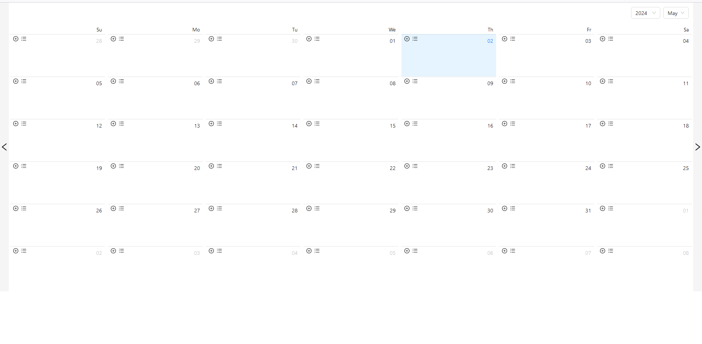
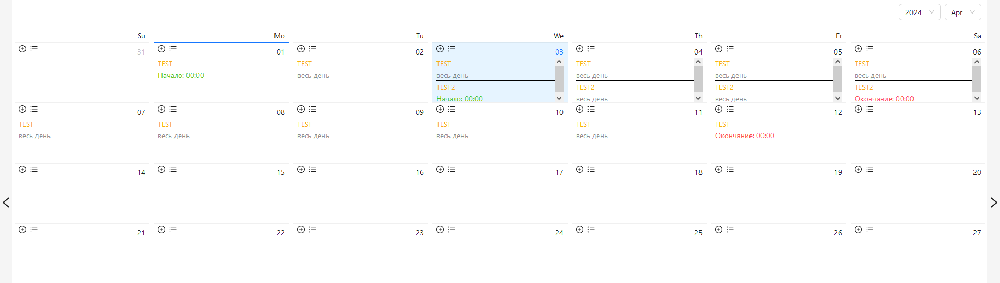
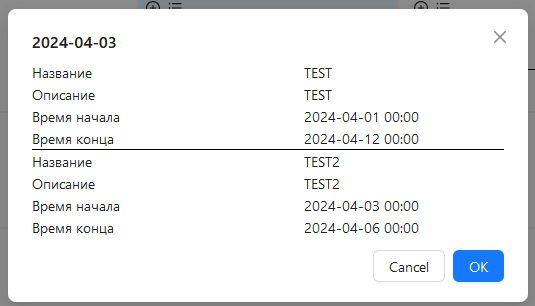
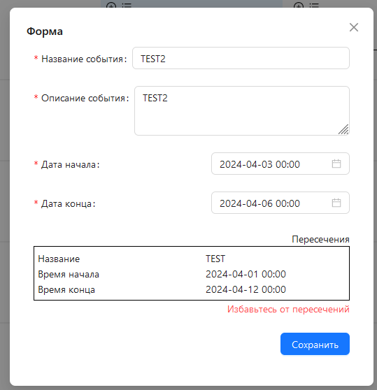

ver 0.1
# Органайзер
Участники:
* Радушин Сергей - Менеджер-Аналитик
* Сивцов Даниил - FrontEnd разработчик
* Эквист Вячеслав - BackEnd разработчик

Что умеет:
* Добавление задач
* Просмотр задач
* Удаление задач
* Изменение задач
* Нахождение конфликтов задач

Фишки:
* При добавлении задачи с коллизией окошко редактирования задачи не скрывается и показывается список коллизий.
* При редактировании задачи тот же сценарий.

Интерфейс:

